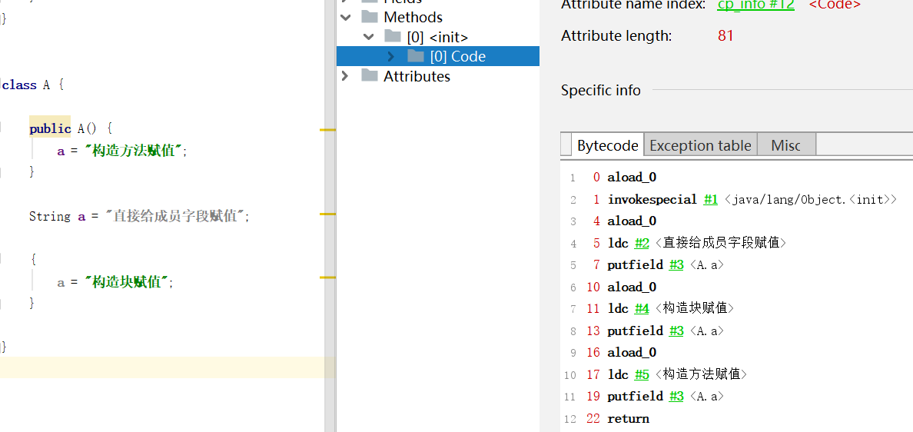

# JVM创建对象的过程

java虚拟机创建对象大概可以分为如下几个步骤：

#### 1.执行相关检查

虚拟机遇到一条new指令时，将会去检查这个指令的参数是否能在常量池中定位到一个类的符号引用，并检查这个符号引用代表的类是否已被加载、解析和初试化过，如果没有，那必须先执行相应的类加载过程。如果发现该类继承有父类，那么会在该类初始化前，初始化父类。

初始化阶段是执行类构造器`<clinit>()`方法的过程，它是由编译器自动收集类中的所有类变量的赋值动作和静态语句块static{}中的语句合并产生的。静态语句块中只能访问到定义在静态语句块之前的静态变量，定义在它之后的静态变量，在前面的静态语句块可以赋值，但不能访问。

**所以父类的静态代码块要先于子类的静态代码块执行。**

#### 2.为对象分配内存

类加载检查完后，将为新生对象分配内存。对象所需内存的大小在类加载完成后便完全确定（JVM可以通过普通Java对象的类元数据信息确定对象大小）。为对象分配内存相当于把一块确定大小的内存从Java堆里划分出来。分配方式分为两种

- 指针碰撞： 如果Java堆是绝对规整的：一边是用过的内存，一边是空闲的内存，中间一个指针作为边界指示器。分配内存只需向空闲那边移动指针，这种分配方式称为"指针碰撞"（Bump the Pointer）。
- 空闲链表：如果Java堆不是规整的：用过的和空闲的内存相互交错，需要维护一个列表，记录哪些内存可用。分配内存时查表找到一个足够大的内存，并更新列表，这种分配方式称为"空闲列表"（Free List）。

Java堆是否规整由JVM采用的垃圾收集器是否带有压缩功能决定的；

#### 3.初始化对象

虚拟机会先将对象分配到的内存空间都初始化为零值。这一步保证了实例字段就算没有赋值也可以直接使用。设置完对象的数据部分后，虚拟机还会设置对象头信息，包括类元数据引用、对象的哈希码（实际是调用hashCode方法时才会设置）、对象的GC分代年龄等。

#### 4.执行对象实例方法`<init>()`

虚拟机层面的`<init>()`方法也就是java语言层面的构造方法，执行完构造方法后，整个对象才算创建完成。

**知识点：**对象实例字段的直接赋值、构造块代码、构造方法代码，在jvm编译后最终都会合并到构造方法中处理，直接赋值与构造块代码按照源码顺序执行，而构造方法中的代码总是在最后执行。那么当三个地方都是对同一个实例字段赋值时，**构造方法中的赋值起决定作用**。如下图所示：

