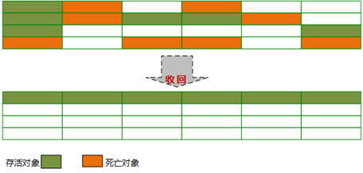

# 基础

## 一：概述

　　在这篇文章中《[Jvm运行时数据区](https://www.cnblogs.com/chenpt/p/8953435.html)》介绍了Java内存运行时区域的各个部分，其中程序计数器、虚拟机栈、本地方法栈，3个区域随着线程的生存而生存的。内存分配和回收都是确定的。随着线程的结束内存自然就被回收了，因此不需要考虑垃圾回收的问题。而Java堆和方法区则不一样，各线程共享，内存的分配和回收都是动态的。因此垃圾收集器所关注的都是这部分内存。

　　接下来我们就讨论Jvm是怎么回收这部分内存的。在进行回收前垃圾收集器第一件事情就是确定哪些对象还存活，哪些已经死去。下面介绍两种基础的回收算法。

### 1.1 引用计数算法

　　给对象添加一个引用计数器，每当有一个地方引用它时计数器就+1，当引用失效时计数器就-1,。只要计数器等于0的对象就是不可能再被使用的。

　　此算法在大部分情况下都是一个不错的选择，也有一些著名的应用案例。但是Java虚拟机中是没有使用的。

　　**优点**：实现简单、判断效率高。

　　**缺点**：很难解决对象之间循环引用的问题。例如下面这个例子

```java
public class ReferenceCountingGC{
    public Object instance = null;
    private static final int _1MB = 1024*1024;
    public byte[] bigSize = new byte[2*_1MB]; // 占点内存，以便在GC日志中查看是否回收过
    
    public static void testGC(){
        ReferenceCountingGC objA = new ReferenceCountingGC();
        ReferenceCountingGC objB = new ReferenceCountingGC();
        objA.instance = objB;
        objB.instance = objA;
        
        System.gc(); // 假设这里发生GC，引用计数法能否回收objA和objB
    }
}　
```

### 1.2 可达性分析算法

　　通过一系列的称为“GC Roots”的对象作为起始点，从这些节点开始向下搜索，搜索所走过的路径称为引用链，当一个对象到GC Roots没有使用任何引用链时，则说明该对象是不可用的。

　　主流的商用程序语言（Java、C#等）在主流的实现中，都是通过可达性分析来判定对象是否存活的。

　　通过下图来清晰的感受gc root与对象展示的联系。所示灰色区域对象是存活的，Object5/6/7均是可回收的对象

 

　**在Java语言中，可作为GC Roots 的对象包括下面几种**

- 虚拟机栈（栈帧中的本地变量表）中引用的对象
- 方法区中静态变量引用的对象
- 方法区中常量引用的对象
- 本地方法栈（即一般说的 Native 方法）中JNI引用的对象

　**优点**：更加精确和严谨，可以分析出循环数据结构相互引用的情况；

　**缺点**：实现比较复杂、需要分析大量数据，消耗大量时间、分析过程需要GC停顿（引用关系不能发生变化），即停顿所有Java执行线程（称为"Stop The World"，是垃圾回收重点关注的问题）。

## 二：引用

　在jdk1.2之后，Java对引用的概念进行了扩充，总体分为4类：强引用、软引用、弱引用、虚引用，这4中引用强度依次逐渐减弱。

- **强引用**：指在代码中普遍存在的，类似 Object obj = new Object(); 这类的引用，只有强引用还存在，GC就永远不会收集被引用的对象。
- **软引用**：指一些还有用但并非必须的对象。直到内存空间不够时（抛出OutOfMemoryError之前），才会被垃圾回收。采用SoftReference类来实现软引用
- **弱引用**：用来描述非必须对象。当垃圾收集器工作时就会回收掉此类对象。采用WeakReference类来实现弱引用。
- **虚引用**：一个对象是否有虚引用的存在，完全不会对其生存时间构成影响， 唯一目的就是能在这个对象被回收时收到一个系统通知， 采用PhantomRenference类实现

###  2.1 判断一个对象生存还是死亡

　　宣告一个对象死亡，至少要经历两次标记。

#### 　　**1、第一次标记**

　　如果对象进行可达性分析算法之后没发现与GC Roots相连的引用链，那它将会第一次标记并且进行一次筛选。

　　**筛选条件**：判断此对象是否有必要执行finalize()方法。

　　**筛选结果**：当对象没有覆盖finalize()方法、或者finalize()方法已经被JVM执行过，则判定为可回收对象。如果对象有必要执行finalize()方法，则被放入F-Queue队列中。稍后在JVM自动建立、低优先级的Finalizer线程（可能多个线程）中触发这个方法；　　

#### 　　2、第二次标记

　　GC对F-Queue队列中的对象进行二次标记。

　　如果对象在finalize()方法中重新与引用链上的任何一个对象建立了关联，那么二次标记时则会将它移出“即将回收”集合。如果此时对象还没成功逃脱，那么只能被回收了。

#### 　　3、finalize() 方法

　　finalize()是Object类的一个方法、一个对象的finalize()方法只会被系统自动调用一次，经过finalize()方法逃脱死亡的对象，第二次不会再调用；

　　特别说明：并不提倡在程序中调用finalize()来进行自救。建议忘掉Java程序中该方法的存在。因为它执行的时间不确定，甚至是否被执行也不确定（Java程序的不正常退出），而且运行代价高昂，无法保证各个对象的调用顺序（甚至有不同线程中调用）。

## 三：回收方法区　　

　　永久代的垃圾收集主要分为两部分内容：废弃常量和无用的类。

### 3.1 回收废弃常量

　　回收废弃常量与Java堆的回收类似。下面举个栗子说明

　　假如一个字符串“abc” 已经进入常量池中，但当前系统没有一个string对象是叫做abc的，也就是说，没有任何string对象的引用指向常量池中的abc常量，也没用其他地方引用这个字面量。如果这是发生内存回收，那么这个常量abc将会被清理出常量池。常量池中的其他类（接口）、方法、字段的符号引用也与此类似。

### 3.2 回收无用的类

　　需要同时满足下面3个条件的才能算是无用的类。

1. 该类所有的实例都已经被回收，也就是Java堆中无任何改类的实例。
2. 加载该类的ClassLoader已经被回收。
3. 该类对应的java.lang.Class对象没有在任何地方被引用，无法在任何地方通过反射访问该类的方法

　　虚拟机可以对同时满足这三个条件的类进行回收，但不是必须进行回收的。是否对类进行回收，HotSpot虚拟机提供了-Xnoclassgc参数进行控制。

# 回收算法

## 一：标记-清除算法

　　最基础的收集算法，总共分为‘ 标记 ’和‘ 清除 ’两个阶段

### 1.标记

　　标记出所有需要回收的对象

　　在《[Jvm垃圾回收器（基础篇）](https://www.cnblogs.com/chenpt/p/9797126.html)》中说明了判断对象是否回收需要两次标记，现在我们再来回顾一下

　　**一次标记**：在经过可达性分析算法后，对象没有与GC Root相关的引用链，那么则被第一次标记。并且进行一次筛选：当对象有必要执行finalize()方法时，则把该对象放入F-Queue队列中。

　　**二次标记**：对F-Queue队列中的对象进行二次标记。在执行finalize()方法时，如果对象重新与GC Root引用链上的任意对象建立了关联，则把他移除出“ 即将回收 ”集合。否则就等着被回收吧！！！

　　对被第一次标记切被第二次标记的，就可以判定位可回收对象了。

### 2.清除

　　两次标记后，还在“ 即将回收 ”集合的对象进行回收。

　　执行过程如下：


　　**优点**：基础最基础的可达性算法，后续的收集算法都是基于这种思想实现的

　　**缺点**：标记和清除效率不高，产生大量不连续的内存碎片，导致创建大对象时找不到连续的空间，不得不提前触发另一次的垃圾回收。

## 二：复制算法

　　将可用内存按容量分为大小相等的两块，每次只使用其中一块，当这一块的内存用完了，就将还存活的对象复制到另外一块内存上，然后再把已使用过的内存空间一次清理掉。

　　复制算法执行过程如下：


　　**优点**：实现简单，效率高。解决了标记-清除算法导致的内存碎片问题。

　　**缺点**：代价太大，将内存缩小了一半。效率随对象的存活率升高而降低。

 现在的商业虚拟机都采用这种算法（需要改良1:1的缺点）来回收新生代。

### 2.1 HotSpot虚拟机的改良算法　

#### 1.弱代理论　

　　分代垃圾收集基于弱代理论。具体描述如下：

- 大多说分配了内存的对象并不会存活太长时间，在处于年轻时代就会死掉。
- 很少有对象会从老年代变成年轻代。

 　其中IBM研究表明：新生代中98%的对象都是"朝生夕死"； 所以并不需要按1:1比例来划分内存（解决了缺点1）；

###  2.Hotspot虚拟机新生代内存布局及算法

　　新生代内存分配一块较大的Eden空间和两块较小的Survivor空间

　　每次使用Eden和其中一块Survivor空间

　　回收时将Eden和Survivor空间中存活的对象一次性复制到另一块Survivor空间上

　　最后清理掉Eden和使用过的Survivor空间。

Hotspot虚拟机默认Eden和Survivor的大小比例是8:1。

#### 分配担保

　　如果另一块Survivor空间没有足够内存来存放上一次新生代收集下来的存活对象，那么这些对象则直接通过担保机制进入老年代。

关于分配担保的内容，我会在讲述垃圾收集器时详细描述。

## 三：标记-整理算法

　　标记-整理算法是根据老年代的特点应运而生。

### 3.1 标记

　　标记过程和标记-清理算法一致（也是基于可达性分析算法）。

### 3.2 整理

　　和标记-清理不同的是，该算法不是针对可回收对象进行清理，而是根据存活对象进行整理。让存活对象都向一端移动，然后直接清理掉边界以外的内存。

标记-整理算法示意图



　　**优点**：不会像复制算法那样随着存活对象的升高而降低效率，不像标记-清除算法那样产生不连续的内存碎片

　　**缺点**：效率问题，除了像标记-清除算法的标记过程外，还多了一步整理过程，效率更低。

## 四：分代收集算法

　　当前商业虚拟机的垃圾收集都是采用“ 分代收集 ”算法。

根据对象存活周期的不同将内存划分为几块。一般把java堆分为新生代和老年代。JVM根据各个年代的特点采用不同的收集算法。

新生代中，每次进行垃圾回收都会发现大量对象死去，只有少量存活，因此比较适合复制算法。只需要付出少量存活对象的复制成本就可以完成收集。

老年代中，因为对象存活率较高，没有额外的空间进行分配担保，所以适合标记-清理、标记-整理算法来进行回收。

第一篇《[Jvm垃圾回收器（基础篇）](https://www.cnblogs.com/chenpt/p/9797126.html)》主要讲述了判断对象的生死？两种基础判断对象生死的算法、引用计数法、可达性分析算法，方法区的回收。在第二篇《[Jvm垃圾回收器（算法篇）](https://www.cnblogs.com/chenpt/p/9799095.html)》中主要介绍了垃圾回收的几种常用算法：标记-清除、复制算法、标记-整理算法、分代收集算法。那么接下来我们重点研究Jvm的垃圾收集器（serial收集器、parnew收集器、parallel scavenge收集器、serial old 收集器、parallel old收集器、cms收集器、g1收集器）。前面说了那么多就是为它做铺垫的。

# 垃圾回收器

**正式进入前先看下图解HotSpot虚拟机所包含的收集器：**


图中展示了7种作用于不同分代的收集器，如果两个收集器之间存在连线，则说明它们可以搭配使用。虚拟机所处的区域则表示它是属于新生代还是老年代收集器。

**新生代收集器**：Serial、ParNew、Parallel Scavenge

**老年代收集器**：CMS、Serial Old、Parallel Old

**整堆收集器**： G1

### 几个相关概念：

**并行收集**：指多条垃圾收集线程并行工作，但此时用户线程仍处于等待状态。

**并发收集**：指用户线程与垃圾收集线程同时工作（不一定是并行的可能会交替执行）。用户程序在继续运行，而垃圾收集程序运行在另一个CPU上。

**吞吐量**：即CPU用于运行用户代码的时间与CPU总消耗时间的比值（吞吐量 = 运行用户代码时间 / ( 运行用户代码时间 + 垃圾收集时间 )）。例如：虚拟机共运行100分钟，垃圾收集器花掉1分钟，那么吞吐量就是99%

## 一：Serial 收集器

Serial收集器是最基本的、发展历史最悠久的收集器。

**特点：**单线程、简单高效（与其他收集器的单线程相比），对于限定单个CPU的环境来说，Serial收集器由于没有线程交互的开销，专心做垃圾收集自然可以获得最高的单线程手机效率。收集器进行垃圾回收时，必须暂停其他所有的工作线程，直到它结束（Stop The World）。

**应用场景**：适用于Client模式下的虚拟机。

**Serial / Serial Old收集器运行示意图**

****

 

## 二：ParNew收集器

ParNew收集器其实就是Serial收集器的多线程版本。

除了使用多线程外其余行为均和Serial收集器一模一样（参数控制、收集算法、Stop The World、对象分配规则、回收策略等）。

**特点**：多线程、ParNew收集器默认开启的收集线程数与CPU的数量相同，在CPU非常多的环境中，可以使用-XX:ParallelGCThreads参数来限制垃圾收集的线程数。

　　　和Serial收集器一样存在Stop The World问题

**应用场景**：ParNew收集器是许多运行在Server模式下的虚拟机中首选的新生代收集器，因为它是除了Serial收集器外，唯一一个能与CMS收集器配合工作的。

**ParNew/Serial Old组合收集器运行示意图如下：**

 

 

## 三：Parallel Scavenge 收集器

与吞吐量关系密切，故也称为吞吐量优先收集器。

**特点**：属于新生代收集器也是采用复制算法的收集器，又是并行的多线程收集器（与ParNew收集器类似）。

该收集器的目标是达到一个可控制的吞吐量。还有一个值得关注的点是：GC自适应调节策略（与ParNew收集器最重要的一个区别）

**GC自适应调节策略**：Parallel Scavenge收集器可设置-XX:+UseAdptiveSizePolicy参数。当开关打开时不需要手动指定新生代的大小（-Xmn）、Eden与Survivor区的比例（-XX:SurvivorRation）、晋升老年代的对象年龄（-XX:PretenureSizeThreshold）等，虚拟机会根据系统的运行状况收集性能监控信息，动态设置这些参数以提供最优的停顿时间和最高的吞吐量，这种调节方式称为GC的自适应调节策略。

Parallel Scavenge收集器使用两个参数控制吞吐量：

- XX:MaxGCPauseMillis 控制最大的垃圾收集停顿时间
- XX:GCRatio 直接设置吞吐量的大小。

## 四：Serial Old 收集器

Serial Old是Serial收集器的老年代版本。

**特点**：同样是单线程收集器，采用标记-整理算法。

**应用场景**：主要也是使用在Client模式下的虚拟机中。也可在Server模式下使用。

Server模式下主要的两大用途（在后续中详细讲解···）：

1. 在JDK1.5以及以前的版本中与Parallel Scavenge收集器搭配使用。
2. 作为CMS收集器的后备方案，在并发收集Concurent Mode Failure时使用。

Serial / Serial Old收集器工作过程图（Serial收集器图示相同）：

****

## **五：Parallel Old 收集器**

是Parallel Scavenge收集器的老年代版本。

**特点**：多线程，采用标记-整理算法。

**应用场景**：注重高吞吐量以及CPU资源敏感的场合，都可以优先考虑Parallel Scavenge+Parallel Old 收集器。

**Parallel Scavenge/Parallel Old收集器工作过程图：**

****

## 六：CMS收集器

一种以获取最短回收停顿时间为目标的收集器。

**特点**：基于标记-清除算法实现。并发收集、低停顿。

**应用场景**：适用于注重服务的响应速度，希望系统停顿时间最短，给用户带来更好的体验等场景下。如web程序、b/s服务。

**CMS收集器的运行过程分为下列4步：**

**初始标记**：标记GC Roots能直接到的对象。速度很快但是仍存在Stop The World问题。

**并发标记**：进行GC Roots Tracing 的过程，找出存活对象且用户线程可并发执行。

**重新标记**：为了修正并发标记期间因用户程序继续运行而导致标记产生变动的那一部分对象的标记记录。仍然存在Stop The World问题。

**并发清除**：对标记的对象进行清除回收。

 CMS收集器的内存回收过程是与用户线程一起并发执行的。

 CMS收集器的工作过程图：


CMS收集器的缺点：

- 对CPU资源非常敏感。
- 无法处理浮动垃圾，可能出现Concurrent Model Failure失败而导致另一次Full GC的产生。
- 因为采用标记-清除算法所以会存在空间碎片的问题，导致大对象无法分配空间，不得不提前触发一次Full GC。

## 七：G1收集器

一款面向服务端应用的垃圾收集器。

**特点如下：**

并行与并发：G1能充分利用多CPU、多核环境下的硬件优势，使用多个CPU来缩短Stop-The-World停顿时间。部分收集器原本需要停顿Java线程来执行GC动作，G1收集器仍然可以通过并发的方式让Java程序继续运行。

分代收集：G1能够独自管理整个Java堆，并且采用不同的方式去处理新创建的对象和已经存活了一段时间、熬过多次GC的旧对象以获取更好的收集效果。

空间整合：G1运作期间不会产生空间碎片，收集后能提供规整的可用内存。

可预测的停顿：G1除了追求低停顿外，还能建立可预测的停顿时间模型。能让使用者明确指定在一个长度为M毫秒的时间段内，消耗在垃圾收集上的时间不得超过N毫秒。

**G1为什么能建立可预测的停顿时间模型？**

因为它有计划的避免在整个Java堆中进行全区域的垃圾收集。G1跟踪各个Region里面的垃圾堆积的大小，在后台维护一个优先列表，每次根据允许的收集时间，优先回收价值最大的Region。这样就保证了在有限的时间内可以获取尽可能高的收集效率。

**G1与其他收集器的区别**：

其他收集器的工作范围是整个新生代或者老年代、G1收集器的工作范围是整个Java堆。在使用G1收集器时，它将整个Java堆划分为多个大小相等的独立区域（Region）。虽然也保留了新生代、老年代的概念，但新生代和老年代不再是相互隔离的，他们都是一部分Region（不需要连续）的集合。

**G1收集器存在的问题：**

Region不可能是孤立的，分配在Region中的对象可以与Java堆中的任意对象发生引用关系。在采用可达性分析算法来判断对象是否存活时，得扫描整个Java堆才能保证准确性。其他收集器也存在这种问题（G1更加突出而已）。会导致Minor GC效率下降。

**G1收集器是如何解决上述问题的？**

采用Remembered Set来避免整堆扫描。G1中每个Region都有一个与之对应的Remembered Set，虚拟机发现程序在对Reference类型进行写操作时，会产生一个Write Barrier暂时中断写操作，检查Reference引用对象是否处于多个Region中（即检查老年代中是否引用了新生代中的对象），如果是，便通过CardTable把相关引用信息记录到被引用对象所属的Region的Remembered Set中。当进行内存回收时，在GC根节点的枚举范围中加入Remembered Set即可保证不对全堆进行扫描也不会有遗漏。

**如果不计算维护 Remembered Set 的操作，G1收集器大致可分为如下步骤：**

**初始标记**：仅标记GC Roots能直接到的对象，并且修改TAMS（Next Top at Mark Start）的值，让下一阶段用户程序并发运行时，能在正确可用的Region中创建新对象。（需要线程停顿，但耗时很短。）

**并发标记**：从GC Roots开始对堆中对象进行可达性分析，找出存活对象。（耗时较长，但可与用户程序并发执行）

**最终标记**：为了修正在并发标记期间因用户程序执行而导致标记产生变化的那一部分标记记录。且对象的变化记录在线程Remembered Set Logs里面，把Remembered Set Logs里面的数据合并到Remembered Set中。（需要线程停顿，但可并行执行。）

**筛选回收**：对各个Region的回收价值和成本进行排序，根据用户所期望的GC停顿时间来制定回收计划。（可并发执行）

**G1收集器运行示意图：**

