## 摘要

Connector（连接器）在自己的线程里接收socket，然后从自己的Processor（处理器）队列中取出一个processor，将socket交给它进行处理。processor会通过socket中的输入流解析http请求，包括请求行、请求头和请求体，分别封装成为java对象。接着processor利用socket中的输入输出流创建request和response对象，并调用与Connector绑定的Container（容器）的invoke方法，参数就为request和response。容器的invoke方法会从解析出客户端想要访问的Servlet的名称，然后通过类加载，创建出对应的servlet对象，并调用其service方法；或者解析出静态资源路径，返回相应的数据。

tomcat里面的组件都实现了lifecycle接口，所以tomcat的启动机制是：连接器启动，最外层容器启动，容器启动其里面的组件和内层容器，嵌套执行直到所有组件和容器启动完成。

## 前言

### 掌握 Tomcat 架构设计与原理提高内功

**宏观上看**

Tomcat 作为一个 「`Http` 服务器 + `Servlet` 容器」，对我们屏蔽了应用层协议和网络通信细节，给我们的是标准的 `Request` 和 `Response` 对象；对于具体的业务逻辑则作为变化点，交给我们来实现。我们使用了`SpringMVC` 之类的框架，可是却从来不需要考虑 `TCP` 连接、 `Http` 协议的数据处理与响应。就是因为 Tomcat 已经为我们做好了这些，我们只需要关注每个请求的具体业务逻辑。

**微观上看**

`Tomcat` 内部也隔离了变化点与不变点，使用了组件化设计，目的就是为了实现「俄罗斯套娃式」的高度定制化（组合模式），而每个组件的生命周期管理又有一些共性的东西，则被提取出来成为接口和抽象类，让具体子类实现变化点，也就是模板方法设计模式。

当今流行的微服务也是这个思路，按照功能将单体应用拆成「微服务」，拆分过程要将共性提取出来，而这些共性就会成为核心的基础服务或者通用库。「中台」思想亦是如此。

设计模式往往就是封装变化的一把利器，合理的运用设计模式能让我们的代码与系统设计变得优雅且整洁。

这就是学习优秀开源软件能获得的「内功」，从不会过时，其中的设计思想与哲学才是根本之道。从中借鉴设计经验，合理运用设计模式封装变与不变，更能从它们的源码中汲取经验，提升自己的系统设计能力。

### 宏观理解一个请求如何与 Spring 联系起来

在工作过程中，我们对 Java 语法已经很熟悉了，甚至「背」过一些设计模式，用过很多 Web 框架，但是很少有机会将他们用到实际项目中，让自己独立设计一个系统似乎也是根据需求一个个 Service 实现而已。脑子里似乎没有一张 Java Web 开发全景图，比如我并不知道浏览器的请求是怎么跟 Spring 中的代码联系起来的。

为了突破这个瓶颈，为何不站在巨人的肩膀上学习优秀的开源系统，看大牛们是如何思考这些问题。

学习 Tomcat 的原理，我发现 `Servlet` 技术是 Web 开发的原点，几乎所有的 Java Web 框架（比如 Spring）都是基于 `Servlet` 的封装，Spring 应用本身就是一个 `Servlet`（`DispatchSevlet`），而 Tomcat 和 Jetty 这样的 Web 容器，负责加载和运行 `Servlet`。如图所示：


### 提升自己的系统设计能力

学习 Tomcat ，我还发现用到不少 Java 高级技术，比如 Java 多线程并发编程、Socket 网络编程以及反射等。之前也只是了解这些技术，为了面试也背过一些题。但是总感觉「知道」与会用之间存在一道沟壑，通过对 Tomcat 源码学习，我学会了什么场景去使用这些技术。

还有就是系统设计能力，比如面向接口编程、组件化组合模式、骨架抽象类、一键式启停、对象池技术以及各种设计模式，比如模板方法、观察者模式、责任链模式等，之后我也开始模仿它们并把这些设计思想运用到实际的工作中。

## 整体架构设计

今天咱们就来一步一步分析 Tomcat 的设计思路，一方面我们可以学到 Tomcat 的总体架构，学会从宏观上怎么去设计一个复杂系统，怎么设计顶层模块，以及模块之间的关系；另一方面也为我们深入学习 Tomcat 的工作原理打下基础。

Tomcat 启动流程：`startup.sh -> catalina.sh start ->java -jar org.apache.catalina.startup.Bootstrap.main()`

Tomcat 实现的 2 个核心功能：

- 处理 `Socket` 连接，负责网络字节流与 `Request` 和 `Response` 对象的转化。
- 加载并管理 `Servlet` ，以及处理具体的 `Request` 请求。

**所以 Tomcat 设计了两个核心组件连接器（Connector）和容器（Container）。连接器负责对外交流，容器负责内部 处理**

`Tomcat`为了实现支持多种 `I/O` 模型和应用层协议，一个容器可能对接多个连接器，就好比一个房间有多个门。

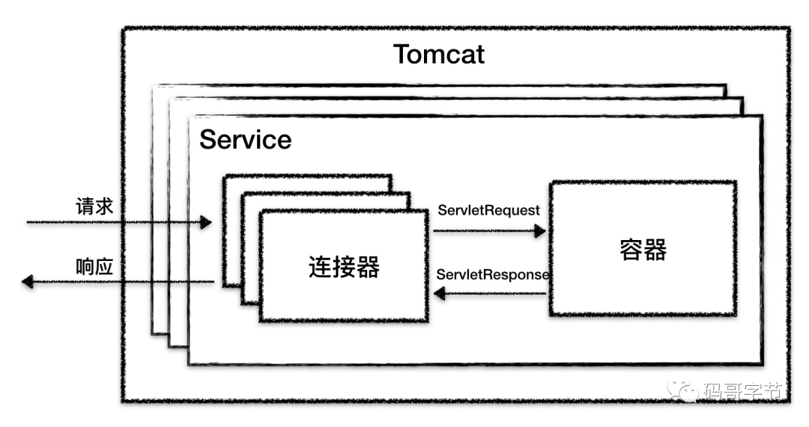Tomcat整体架构

- Server 对应的就是一个 Tomcat 实例。
- Service 默认只有一个，也就是一个 Tomcat 实例默认一个 Service。
- Connector：一个 Service 可能多个 连接器，接受不同连接协议。
- Container: 多个连接器对应一个容器，顶层容器其实就是 Engine。

**每个组件都有对应的生命周期，需要启动，同时还要启动自己内部的子组件，比如一个 Tomcat 实例包含一个 Service，一个 Service 包含多个连接器和一个容器。而一个容器包含多个 Host， Host 内部可能有多个 Context 容器，而一个 Context 也会包含多个 Servlet，所以 Tomcat 利用组合模式管理组件每个组件，对待过个也想对待单个组一样对待**。整体上每个组件设计就像是「俄罗斯套娃」一样。

### 连接器

在开始讲连接器前，我先铺垫一下 `Tomcat`支持的多种 `I/O` 模型和应用层协议。

`Tomcat`支持的 `I/O` 模型有：

- `NIO`：非阻塞 `I/O`，采用 `Java NIO` 类库实现。
- `NIO2`：异步`I/O`，采用 `JDK 7` 最新的 `NIO2` 类库实现。
- `APR`：采用 `Apache`可移植运行库实现，是 `C/C++` 编写的本地库。

Tomcat 支持的应用层协议有：

- `HTTP/1.1`：这是大部分 Web 应用采用的访问协议。
- `AJP`：用于和 Web 服务器集成（如 Apache）。
- `HTTP/2`：HTTP 2.0 大幅度的提升了 Web 性能。

所以一个容器可能对接多个连接器。连接器对 `Servlet` 容器屏蔽了网络协议与 `I/O` 模型的区别，无论是 `Http` 还是 `AJP`，在容器中获取到的都是一个标准的 `ServletRequest` 对象。

细化连接器的功能需求就是：

- 监听网络端口。
- 接受网络连接请求。
- 读取请求网络字节流。
- 根据具体应用层协议（`HTTP/AJP`）解析字节流，生成统一的 `Tomcat Request` 对象。
- 将 `Tomcat Request` 对象转成标准的 `ServletRequest`。
- 调用 `Servlet`容器，得到 `ServletResponse`。
- 将 `ServletResponse`转成 `Tomcat Response` 对象。
- 将 `Tomcat Response` 转成网络字节流。
- 将响应字节流写回给浏览器。

需求列清楚后，我们要考虑的下一个问题是，连接器应该有哪些子模块？优秀的模块化设计应该考虑**高内聚、低耦合**。

- **高内聚**是指相关度比较高的功能要尽可能集中，不要分散。
- **低耦合**是指两个相关的模块要尽可能减少依赖的部分和降低依赖的程度，不要让两个模块产生强依赖。

我们发现连接器需要完成 3 个**高内聚**的功能：

- 网络通信。
- 应用层协议解析。
- `Tomcat Request/Response` 与 `ServletRequest/ServletResponse` 的转化。

因此 Tomcat 的设计者设计了 3 个组件来实现这 3 个功能，分别是 `EndPoint、Processor 和 Adapter`。

网络通信的 I/O 模型是变化的, 应用层协议也是变化的，但是整体的处理逻辑是不变的，`EndPoint` 负责提供字节流给 `Processor`，`Processor`负责提供 `Tomcat Request` 对象给 `Adapter`，`Adapter`负责提供 `ServletRequest`对象给容器。

**封装变与不变**

因此 Tomcat 设计了一系列抽象基类来**封装这些稳定的部分**，抽象基类 `AbstractProtocol`实现了 `ProtocolHandler`接口。每一种应用层协议有自己的抽象基类，比如 `AbstractAjpProtocol`和 `AbstractHttp11Protocol`，具体协议的实现类扩展了协议层抽象基类。

这就是模板方法设计模式的运用。

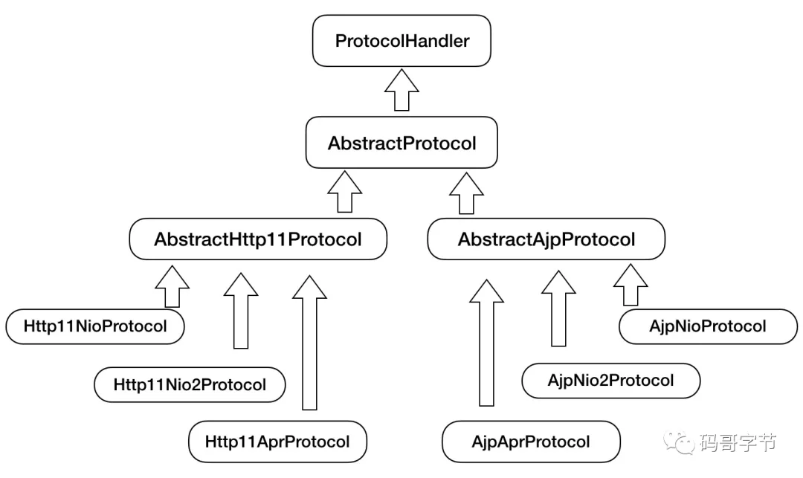

总结下来，连接器的三个核心组件 `Endpoint`、`Processor`和 `Adapter`来分别做三件事情，其中 `Endpoint`和 `Processor`放在一起抽象成了 `ProtocolHandler`组件，它们的关系如下图所示。

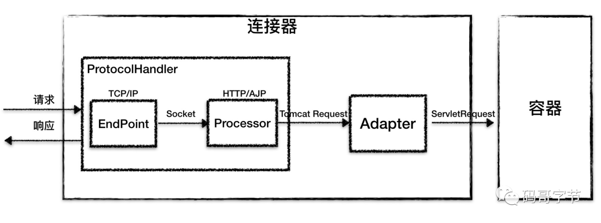

#### ProtocolHandler 组件

主要处理 **网络连接** 和 **应用层协议** ，包含了两个重要部件 EndPoint 和 Processor，两个组件组合形成 ProtocoHandler，下面我来详细介绍它们的工作原理。

##### EndPoint

`EndPoint`是通信端点，即通信监听的接口，是具体的 Socket 接收和发送处理器，是对传输层的抽象，因此 `EndPoint`是用来实现 `TCP/IP` 协议数据读写的，本质调用操作系统的 socket 接口。

`EndPoint`是一个接口，对应的抽象实现类是 `AbstractEndpoint`，而 `AbstractEndpoint`的具体子类，比如在 `NioEndpoint`和 `Nio2Endpoint`中，有两个重要的子组件：`Acceptor`和 `SocketProcessor`。

其中 Acceptor 用于监听 Socket 连接请求。`SocketProcessor`用于处理 `Acceptor` 接收到的 `Socket`请求，它实现 `Runnable`接口，在 `Run`方法里调用应用层协议处理组件 `Processor` 进行处理。为了提高处理能力，`SocketProcessor`被提交到线程池来执行。

我们知道，对于 Java 的多路复用器的使用，无非是两步：

1. 创建一个 Seletor，在它身上注册各种感兴趣的事件，然后调用 select 方法，等待感兴趣的事情发生。
2. 感兴趣的事情发生了，比如可以读了，这时便创建一个新的线程从 Channel 中读数据。

在 Tomcat 中 `NioEndpoint` 则是 `AbstractEndpoint` 的具体实现，里面组件虽然很多，但是处理逻辑还是前面两步。它一共包含 `LimitLatch`、`Acceptor`、`Poller`、`SocketProcessor`和`Executor` 共 5 个组件，分别分工合作实现整个 TCP/IP 协议的处理。

- LimitLatch 是连接控制器，它负责控制最大连接数，NIO 模式下默认是 10000，达到这个阈值后，连接请求被拒绝。
- `Acceptor`跑在一个单独的线程里，它在一个死循环里调用 `accept`方法来接收新连接，一旦有新的连接请求到来，`accept`方法返回一个 `Channel` 对象，接着把 `Channel`对象交给 Poller 去处理。
- `Poller` 的本质是一个 `Selector`，也跑在单独线程里。`Poller`在内部维护一个`Channel`数组，它在一个死循环里不断检测 `Channel`的数据就绪状态，一旦有 `Channel`可读，就生成一个 `SocketProcessor`任务对象扔给 `Executor`去处理。
- SocketProcessor 实现了 Runnable 接口，其中 run 方法中的 `getHandler().process(socketWrapper, SocketEvent.CONNECT_FAIL);` 代码则是获取 handler 并执行处理 socketWrapper，最后通过 socket 获取合适应用层协议处理器，也就是调用 Http11Processor 组件来处理请求。Http11Processor 读取 Channel 的数据来生成 ServletRequest 对象，Http11Processor 并不是直接读取 Channel 的。这是因为 Tomcat 支持同步非阻塞 I/O 模型和异步 I/O 模型，在 Java API 中，相应的 Channel 类也是不一样的，比如有 AsynchronousSocketChannel 和 SocketChannel，为了对 Http11Processor 屏蔽这些差异，Tomcat 设计了一个包装类叫作 SocketWrapper，Http11Processor 只调用 SocketWrapper 的方法去读写数据。
- `Executor`就是线程池，负责运行 `SocketProcessor`任务类，`SocketProcessor` 的 `run`方法会调用 `Http11Processor` 来读取和解析请求数据。我们知道，`Http11Processor`是应用层协议的封装，它会调用容器获得响应，再把响应通过 `Channel`写出。

工作流程如下所示：

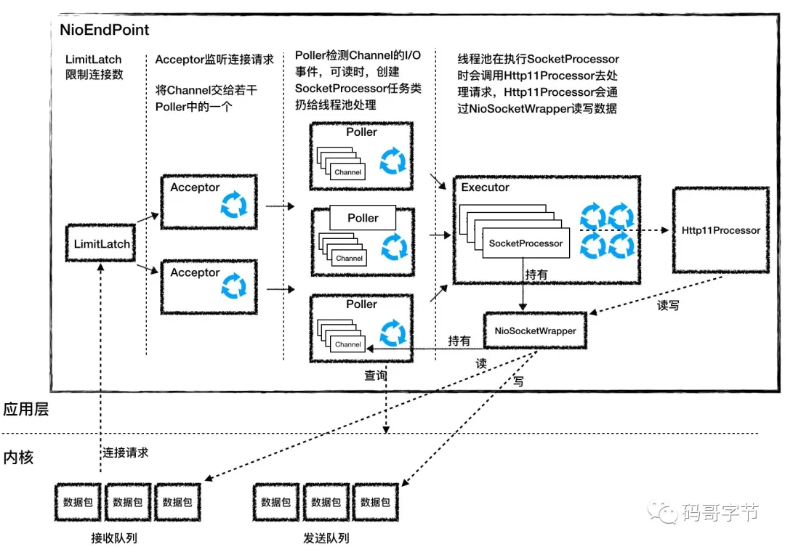

##### Processor

Processor 用来实现 HTTP 协议，Processor 接收来自 EndPoint 的 Socket，读取字节流解析成 Tomcat Request 和 Response 对象，并通过 Adapter 将其提交到容器处理，Processor 是对应用层协议的抽象。

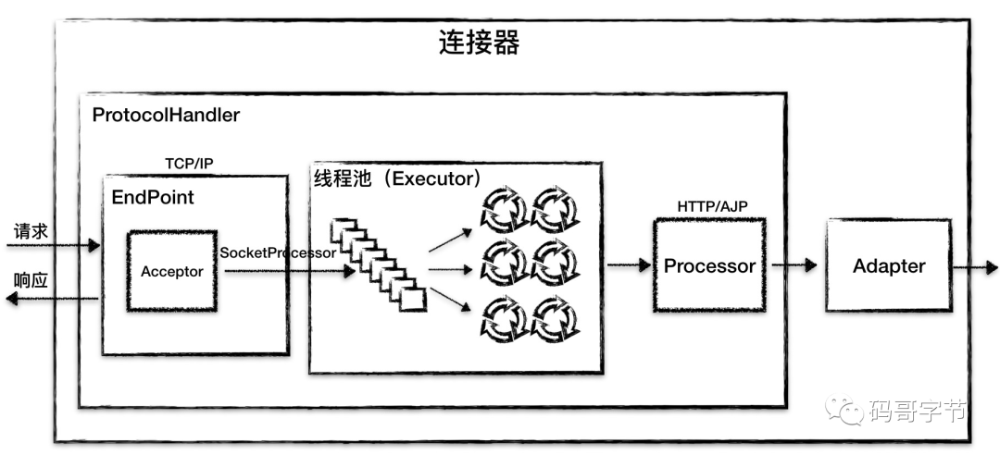

**从图中我们看到，EndPoint 接收到 Socket 连接后，生成一个 SocketProcessor 任务提交到线程池去处理，SocketProcessor 的 Run 方法会调用 HttpProcessor 组件去解析应用层协议，Processor 通过解析生成 Request 对象后，会调用 Adapter 的 Service 方法，方法内部通过 以下代码将请求传递到容器中。**

```java
// Calling the container
connector.getService().getContainer().getPipeline().getFirst().invoke(request, response);
```

#### Adapter 组件

由于协议的不同，Tomcat 定义了自己的 `Request` 类来存放请求信息，这里其实体现了面向对象的思维。但是这个 Request 不是标准的 `ServletRequest` ，所以不能直接使用 Tomcat 定义 Request 作为参数直接容器。

Tomcat 设计者的解决方案是引入 `CoyoteAdapter`，这是适配器模式的经典运用，连接器调用 `CoyoteAdapter` 的 `Sevice` 方法，传入的是 `Tomcat Request` 对象，`CoyoteAdapter`负责将 `Tomcat Request` 转成 `ServletRequest`，再调用容器的 `Service`方法。

### 容器

连接器负责外部交流，容器负责内部处理。具体来说就是，连接器处理 Socket 通信和应用层协议的解析，得到 `Servlet`请求；而容器则负责处理 `Servlet`请求。

容器：顾名思义就是拿来装东西的， 所以 Tomcat 容器就是拿来装载 `Servlet`。

Tomcat 设计了 4 种容器，分别是 `Engine`、`Host`、`Context`和 `Wrapper`。`Server` 代表 Tomcat 实例。

要注意的是这 4 种容器不是平行关系，属于父子关系，如下图所示：

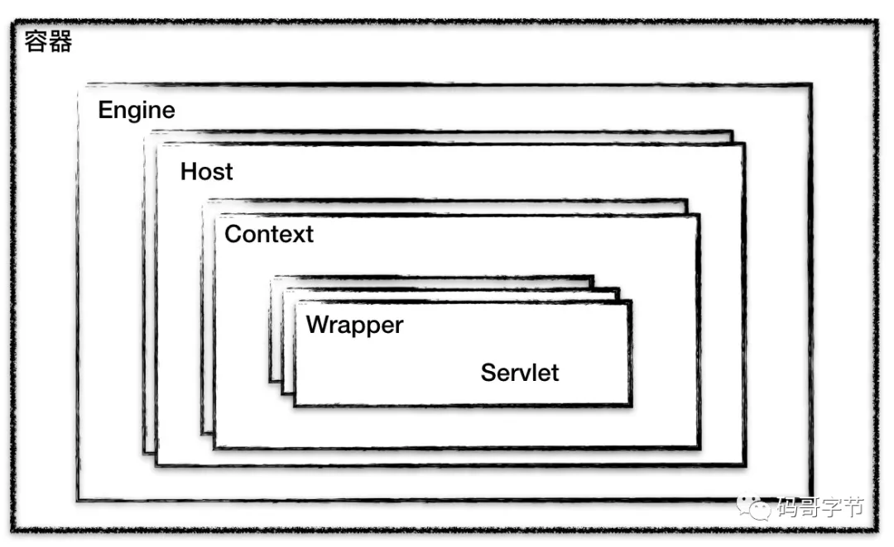

你可能会问，为啥要设计这么多层次的容器，这不是增加复杂度么？其实这背后的考虑是，**Tomcat 通过一种分层的架构，使得 Servlet 容器具有很好的灵活性。因为这里正好符合一个 Host 多个 Context， 一个 Context 也包含多个 Servlet，而每个组件都需要统一生命周期管理，所以组合模式设计这些容器**

`Wrapper` 表示一个 `Servlet` ，`Context` 表示一个 Web 应用程序，而一个 Web 程序可能有多个 `Servlet` ；`Host` 表示一个虚拟主机，或者说一个站点，一个 Tomcat 可以配置多个站点（Host）；一个站点（ Host） 可以部署多个 Web 应用；`Engine` 代表 引擎，用于管理多个站点（Host），一个 Service 只能有 一个 `Engine`。

可通过 Tomcat 配置文件加深对其层次关系理解。

```xml
<Server port="8005" shutdown="SHUTDOWN"> // 顶层组件，可包含多个 Service，代表一个 Tomcat 实例

  <Service name="Catalina">  // 顶层组件，包含一个 Engine ，多个连接器
    <Connector port="8080" protocol="HTTP/1.1" connectionTimeout="20000" redirectPort="8443" />

    <Connector port="8009" protocol="AJP/1.3" redirectPort="8443" />  // 连接器
      
    <Engine name="Catalina" defaultHost="localhost">  // 容器组件：一个 Engine 处理 Service 所有请求，包含多个 Host
 	  
      <Host name="localhost"  appBase="webapps" unpackWARs="true" autoDeploy="true"> // 容器组件：处理指定Host下的客户端请求， 可包含多个 Context
          
   		<Context></Context>// 容器组件：处理特定 Context Web应用的所有客户端请求
          
      </Host>
    </Engine>
  </Service>
</Server>
```

如何管理这些容器？我们发现容器之间具有父子关系，形成一个树形结构，是不是想到了设计模式中的 **组合模式** 。

Tomcat 就是用组合模式来管理这些容器的。具体实现方法是，**所有容器组件都实现了 `Container`接口，因此组合模式可以使得用户对单容器对象和组合容器对象的使用具有一致性**。这里单容器对象指的是最底层的 `Wrapper`，组合容器对象指的是上面的 `Context`、`Host`或者`Engine`。`Container` 接口定义如下：

```java
public interface Container extends Lifecycle {
    public void setName(String name);
    public Container getParent();
    public void setParent(Container container);
    public void addChild(Container child);
    public void removeChild(Container child);
    public Container findChild(String name);
}
```

我们看到了`getParent`、`SetParent`、`addChild`和 `removeChild`等方法，这里正好验证了我们说的组合模式。我们还看到 `Container`接口拓展了 `Lifecycle` ，Tomcat 就是通过 `Lifecycle` 统一管理所有容器的组件的生命周期。通过组合模式管理所有容器，拓展 `Lifecycle` 实现对每个组件的生命周期管理 ，`Lifecycle` 主要包含的方法`init()、start()、stop() 和 destroy()`。

#### 请求定位 Servlet 的过程

一个请求是如何定位到让哪个 `Wrapper` 的 `Servlet` 处理的？答案是，Tomcat 是用 Mapper 组件来完成这个任务的。

`Mapper` 组件的功能就是将用户请求的 `URL` 定位到一个 `Servlet`，它的工作原理是：`Mapper`组件里保存了 Web 应用的配置信息，其实就是**容器组件与访问路径的映射关系**，比如 `Host`容器里配置的域名、`Context`容器里的 `Web`应用路径，以及 `Wrapper`容器里 `Servlet` 映射的路径，你可以想象这些配置信息就是一个多层次的 `Map`。

当一个请求到来时，`Mapper` 组件通过解析请求 URL 里的域名和路径，再到自己保存的 Map 里去查找，就能定位到一个 `Servlet`。请你注意，一个请求 URL 最后只会定位到一个 `Wrapper`容器，也就是一个 `Servlet`。

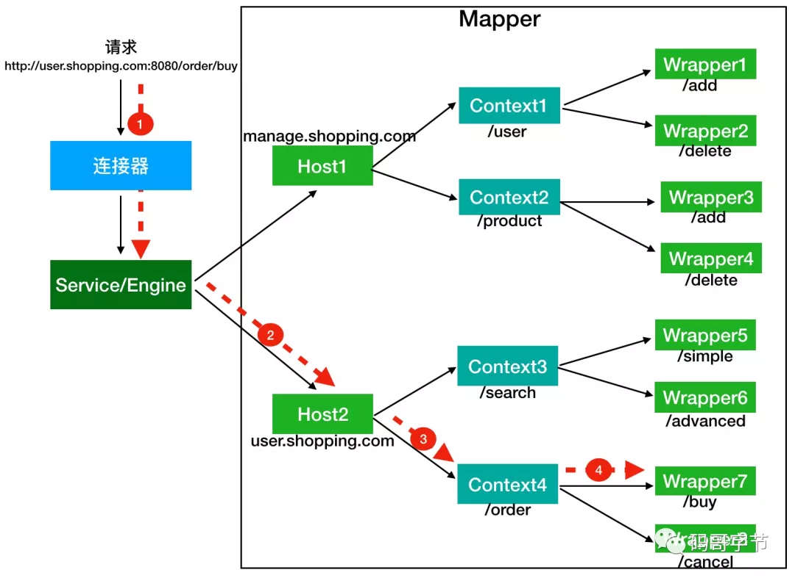

假如有用户访问一个 URL，比如图中的`http://user.shopping.com:8080/order/buy`，Tomcat 如何将这个 URL 定位到一个 Servlet 呢？

1. **首先根据协议和端口号确定 Service 和 Engine**。Tomcat 默认的 HTTP 连接器监听 8080 端口、默认的 AJP 连接器监听 8009 端口。上面例子中的 URL 访问的是 8080 端口，因此这个请求会被 HTTP 连接器接收，而一个连接器是属于一个 Service 组件的，这样 Service 组件就确定了。我们还知道一个 Service 组件里除了有多个连接器，还有一个容器组件，具体来说就是一个 Engine 容器，因此 Service 确定了也就意味着 Engine 也确定了。
2. **根据域名选定 Host。** Service 和 Engine 确定后，Mapper 组件通过 URL 中的域名去查找相应的 Host 容器，比如例子中的 URL 访问的域名是`user.shopping.com`，因此 Mapper 会找到 Host2 这个容器。
3. **根据 URL 路径找到 Context 组件。** Host 确定以后，Mapper 根据 URL 的路径来匹配相应的 Web 应用的路径，比如例子中访问的是 /order，因此找到了 Context4 这个 Context 容器。
4. **根据 URL 路径找到 Wrapper（Servlet）。** Context 确定后，Mapper 再根据 web.xml 中配置的 Servlet 映射路径来找到具体的 Wrapper 和 Servlet。
5. **如果有Filter，先执行Filter。**如果配置了Filter，则根据web.xml中配置的路径确定是否拦截，如果拦截了需要限制性Filter。

连接器中的 Adapter 会调用容器的 Service 方法来执行 Servlet，最先拿到请求的是 Engine 容器，Engine 容器对请求做一些处理后，会把请求传给自己子容器 Host 继续处理，依次类推，最后这个请求会传给 Wrapper 容器，Wrapper 会调用最终的 Servlet 来处理。那么这个调用过程具体是怎么实现的呢？答案是使用 Pipeline-Valve 管道。

`Pipeline-Valve` 是责任链模式，责任链模式是指在一个请求处理的过程中有很多处理者依次对请求进行处理，每个处理者负责做自己相应的处理，处理完之后将再调用下一个处理者继续处理，Valve 表示一个处理点（也就是一个处理阀门），因此 `invoke`方法就是来处理请求的。

```java
public interface Valve {
  public Valve getNext();
  public void setNext(Valve valve);
  public void invoke(Request request, Response response)
}
```

继续看 Pipeline 接口

```
public interface Pipeline {
  public void addValve(Valve valve);
  public Valve getBasic();
  public void setBasic(Valve valve);
  public Valve getFirst();
}
```

`Pipeline`中有 `addValve`方法。Pipeline 中维护了 `Valve`链表，`Valve`可以插入到`Pipeline`中，对请求做某些处理。我们还发现 Pipeline 中没有 invoke 方法，因为整个调用链的触发是 Valve 来完成的，`Valve`完成自己的处理后，调用 `getNext.invoke()` 来触发下一个 Valve 调用。

其实每个容器都有一个 Pipeline 对象，只要触发了这个 Pipeline 的第一个 Valve，这个容器里`Pipeline`中的 Valve 就都会被调用到。但是，不同容器的 Pipeline 是怎么链式触发的呢，比如 Engine 中 Pipeline 需要调用下层容器 Host 中的 Pipeline。

这是因为 `Pipeline`中还有个 `getBasic`方法。这个 `BasicValve`处于 `Valve`链表的末端，它是 `Pipeline`中必不可少的一个 `Valve`，负责调用下层容器的 Pipeline 里的第一个 Valve。

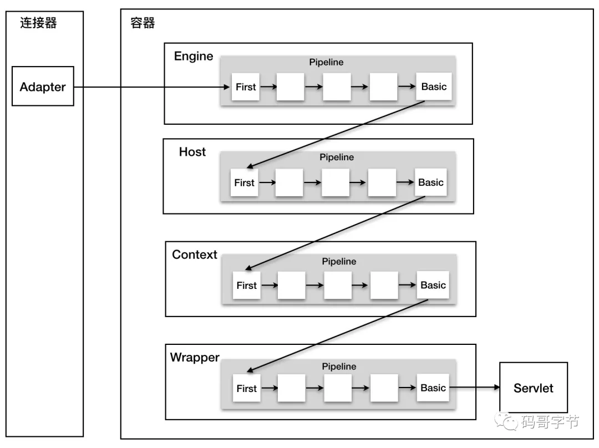

整个过程分是通过连接器中的 `CoyoteAdapter` 触发，它会调用 Engine 的第一个 Valve：

```java
@Override
public void service(org.apache.coyote.Request req, org.apache.coyote.Response res) {
    // 省略其他代码
    // Calling the container
    connector.getService().getContainer().getPipeline().getFirst().invoke(
        request, response);
    ...
}
```

Wrapper 容器的最后一个 Valve 会创建一个 Filter 链，并调用 `doFilter()` 方法，最终会调到 `Servlet`的 `service`方法。

前面我们不是讲到了 `Filter`，似乎也有相似的功能，那 `Valve` 和 `Filter`有什么区别吗？它们的区别是：

- `Valve`是 `Tomcat`的私有机制，与 Tomcat 的基础架构 `API`是紧耦合的。`Servlet API`是公有的标准，所有的 Web 容器包括 Jetty 都支持 Filter 机制。
- 另一个重要的区别是 `Valve`工作在 Web 容器级别，拦截所有应用的请求；而 `Servlet Filter` 工作在应用级别，只能拦截某个 `Web` 应用的所有请求。如果想做整个 `Web`容器的拦截器，必须通过 `Valve`来实现。

#### Lifecycle 生命周期

前面我们看到 `Container`容器 继承了 `Lifecycle` 生命周期。如果想让一个系统能够对外提供服务，我们需要创建、组装并启动这些组件；在服务停止的时候，我们还需要释放资源，销毁这些组件，因此这是一个动态的过程。也就是说，Tomcat 需要动态地管理这些组件的生命周期。

如何统一管理组件的创建、初始化、启动、停止和销毁？如何做到代码逻辑清晰？如何方便地添加或者删除组件？如何做到组件启动和停止不遗漏、不重复？

##### 一键式启停：LifeCycle 接口

设计就是要找到系统的变化点和不变点。这里的不变点就是每个组件都要经历创建、初始化、启动这几个过程，这些状态以及状态的转化是不变的。而变化点是每个具体组件的初始化方法，也就是启动方法是不一样的。

因此，Tomcat 把不变点抽象出来成为一个接口，这个接口跟生命周期有关，叫作 LifeCycle。LifeCycle 接口里定义这么几个方法：`init()、start()、stop() 和 destroy()`，每个具体的组件（也就是容器）去实现这些方法。

在父组件的 `init()` 方法里需要创建子组件并调用子组件的 `init()` 方法。同样，在父组件的 `start()`方法里也需要调用子组件的 `start()` 方法，因此调用者可以无差别的调用各组件的 `init()` 方法和 `start()` 方法，这就是**组合模式**的使用，并且只要调用最顶层组件，也就是 Server 组件的 `init()`和`start()` 方法，整个 Tomcat 就被启动起来了。所以 Tomcat 采取组合模式管理容器，容器继承 LifeCycle 接口，这样就可以向针对单个对象一样一键管理各个容器的生命周期，整个 Tomcat 就启动起来。

##### 可扩展性：LifeCycle 事件

我们再来考虑另一个问题，那就是系统的可扩展性。因为各个组件`init()` 和 `start()` 方法的具体实现是复杂多变的，比如在 Host 容器的启动方法里需要扫描 webapps 目录下的 Web 应用，创建相应的 Context 容器，如果将来需要增加新的逻辑，直接修改`start()` 方法？这样会违反开闭原则，那如何解决这个问题呢？开闭原则说的是为了扩展系统的功能，你不能直接修改系统中已有的类，但是你可以定义新的类。

**组件的 `init()` 和 `start()` 调用是由它的父组件的状态变化触发的，上层组件的初始化会触发子组件的初始化，上层组件的启动会触发子组件的启动，因此我们把组件的生命周期定义成一个个状态，把状态的转变看作是一个事件。而事件是有监听器的，在监听器里可以实现一些逻辑，并且监听器也可以方便的添加和删除**，这就是典型的**观察者模式**。

以下就是 `Lyfecycle` 接口的定义:

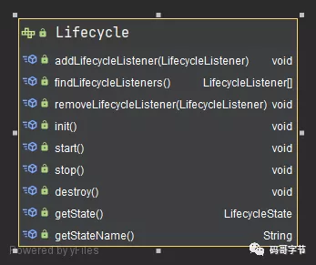

##### 重用性：LifeCycleBase 抽象基类

再次看到抽象模板设计模式。

有了接口，我们就要用类去实现接口。一般来说实现类不止一个，不同的类在实现接口时往往会有一些相同的逻辑，如果让各个子类都去实现一遍，就会有重复代码。那子类如何重用这部分逻辑呢？其实就是定义一个基类来实现共同的逻辑，然后让各个子类去继承它，就达到了重用的目的。

Tomcat 定义一个基类 LifeCycleBase 来实现 LifeCycle 接口，把一些公共的逻辑放到基类中去，比如生命状态的转变与维护、生命事件的触发以及监听器的添加和删除等，而子类就负责实现自己的初始化、启动和停止等方法。

```java
public abstract class LifecycleBase implements Lifecycle{
    // 持有所有的观察者
    private final List<LifecycleListener> lifecycleListeners = new CopyOnWriteArrayList<>();
    /**
     * 发布事件
     *
     * @param type  Event type
     * @param data  Data associated with event.
     */
    protected void fireLifecycleEvent(String type, Object data) {
        LifecycleEvent event = new LifecycleEvent(this, type, data);
        for (LifecycleListener listener : lifecycleListeners) {
            listener.lifecycleEvent(event);
        }
    }
    // 模板方法定义整个启动流程，启动所有容器
    @Override
    public final synchronized void init() throws LifecycleException {
        //1. 状态检查
        if (!state.equals(LifecycleState.NEW)) {
            invalidTransition(Lifecycle.BEFORE_INIT_EVENT);
        }

        try {
            //2. 触发 INITIALIZING 事件的监听器
            setStateInternal(LifecycleState.INITIALIZING, null, false);
            // 3. 调用具体子类的初始化方法
            initInternal();
            // 4. 触发 INITIALIZED 事件的监听器
            setStateInternal(LifecycleState.INITIALIZED, null, false);
        } catch (Throwable t) {
            ExceptionUtils.handleThrowable(t);
            setStateInternal(LifecycleState.FAILED, null, false);
            throw new LifecycleException(
                    sm.getString("lifecycleBase.initFail",toString()), t);
        }
    }
}
```

Tomcat 为了实现一键式启停以及优雅的生命周期管理，并考虑到了可扩展性和可重用性，将面向对象思想和设计模式发挥到了极致，`Containaer`接口维护了容器的父子关系，`Lifecycle` 组合模式实现组件的生命周期维护，生命周期每个组件有变与不变的点，运用模板方法模式。分别运用了**组合模式、观察者模式、骨架抽象类和模板方法**。

如果你需要维护一堆具有父子关系的实体，可以考虑使用组合模式。

观察者模式听起来 “高大上”，其实就是当一个事件发生后，需要执行一连串更新操作。实现了低耦合、非侵入式的通知与更新机制。

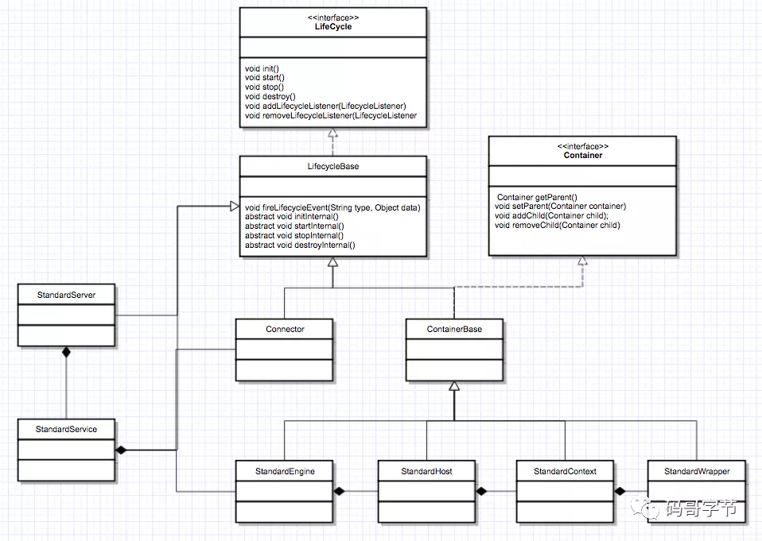

`Container` 继承了 LifeCycle，StandardEngine、StandardHost、StandardContext 和 StandardWrapper 是相应容器组件的具体实现类，因为它们都是容器，所以继承了 ContainerBase 抽象基类，而 ContainerBase 实现了 Container 接口，也继承了 LifeCycleBase 类，它们的生命周期管理接口和功能接口是分开的，这也符合设计中**接口分离的原则**。

### Tomcat 为何打破双亲委派机制

#### 双亲委派

我们知道 `JVM`的类加载器加载 Class 的时候基于双亲委派机制，也就是会将加载交给自己的父加载器加载，如果 父加载器为空则查找`Bootstrap` 是否加载过，当无法加载的时候才让自己加载。JDK 提供一个抽象类 `ClassLoader`，这个抽象类中定义了三个关键方法。对外使用`loadClass(String name) 用于子类重写打破双亲委派：loadClass(String name, boolean resolve)`

```java
public Class<?> loadClass(String name) throws ClassNotFoundException {
    return loadClass(name, false);
}
protected Class<?> loadClass(String name, boolean resolve)
    throws ClassNotFoundException
{
    synchronized (getClassLoadingLock(name)) {
        // 查找该 class 是否已经被加载过
        Class<?> c = findLoadedClass(name);
        // 如果没有加载过
        if (c == null) {
            // 委托给父加载器去加载，递归调用
            if (parent != null) {
                c = parent.loadClass(name, false);
            } else {
                // 如果父加载器为空，查找 Bootstrap 是否加载过
                c = findBootstrapClassOrNull(name);
            }
            // 若果依然加载不到，则调用自己的 findClass 去加载
            if (c == null) {
                c = findClass(name);
            }
        }
        if (resolve) {
            resolveClass(c);
        }
        return c;
    }
}
protected Class<?> findClass(String name){
    //1. 根据传入的类名 name，到在特定目录下去寻找类文件，把.class 文件读入内存
    ...

        //2. 调用 defineClass 将字节数组转成 Class 对象
        return defineClass(buf, off, len)；
}

// 将字节码数组解析成一个 Class 对象，用 native 方法实现
protected final Class<?> defineClass(byte[] b, int off, int len){
    ...
}
```

JDK 中有 3 个类加载器，另外你也可以自定义类加载器，它们的关系如下图所示。

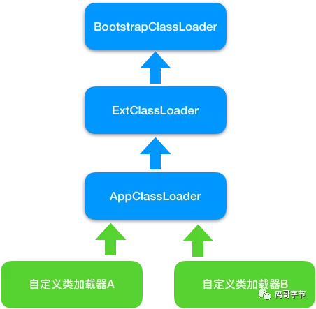

- `BootstrapClassLoader`是启动类加载器，由 C 语言实现，用来加载 `JVM`启动时所需要的核心类，比如`rt.jar`、`resources.jar`等。
- `ExtClassLoader`是扩展类加载器，用来加载`\jre\lib\ext`目录下 JAR 包。
- `AppClassLoader`是系统类加载器，用来加载 `classpath`下的类，应用程序默认用它来加载类。
- 自定义类加载器，用来加载自定义路径下的类。

这些类加载器的工作原理是一样的，区别是它们的加载路径不同，也就是说 `findClass`这个方法查找的路径不同。双亲委托机制是为了保证一个 Java 类在 JVM 中是唯一的，假如你不小心写了一个与 JRE 核心类同名的类，比如 `Object`类，双亲委托机制能保证加载的是 `JRE`里的那个 `Object`类，而不是你写的 `Object`类。这是因为 `AppClassLoader`在加载你的 Object 类时，会委托给 `ExtClassLoader`去加载，而 `ExtClassLoader`又会委托给 `BootstrapClassLoader`，`BootstrapClassLoader`发现自己已经加载过了 `Object`类，会直接返回，不会去加载你写的 `Object`类。我们最多只能 获取到 `ExtClassLoader`这里注意下。

#### Tomcat 热加载

Tomcat 本质是通过一个后台线程做周期性的任务，定期检测类文件的变化，如果有变化就重新加载类。我们来看 `ContainerBackgroundProcessor`具体是如何实现的。

```java
protected class ContainerBackgroundProcessor implements Runnable {

    @Override
    public void run() {
        // 请注意这里传入的参数是 " 宿主类 " 的实例
        processChildren(ContainerBase.this);
    }

    protected void processChildren(Container container) {
        try {
            //1. 调用当前容器的 backgroundProcess 方法。
            container.backgroundProcess();

            //2. 遍历所有的子容器，递归调用 processChildren，
            // 这样当前容器的子孙都会被处理
            Container[] children = container.findChildren();
            for (int i = 0; i < children.length; i++) {
            // 这里请你注意，容器基类有个变量叫做 backgroundProcessorDelay，如果大于 0，表明子容器有自己的后台线程，无需父容器来调用它的 processChildren 方法。
                if (children[i].getBackgroundProcessorDelay() <= 0) {
                    processChildren(children[i]);
                }
            }
        } catch (Throwable t) { ... }
```

Tomcat 的热加载就是在 Context 容器实现，主要是调用了 Context 容器的 reload 方法。抛开细节从宏观上看主要完成以下任务：

1. 停止和销毁 Context 容器及其所有子容器，子容器其实就是 Wrapper，也就是说 Wrapper 里面 Servlet 实例也被销毁了。
2. 停止和销毁 Context 容器关联的 Listener 和 Filter。
3. 停止和销毁 Context 下的 Pipeline 和各种 Valve。
4. 停止和销毁 Context 的类加载器，以及类加载器加载的类文件资源。
5. 启动 Context 容器，在这个过程中会重新创建前面四步被销毁的资源。

在这个过程中，类加载器发挥着关键作用。一个 Context 容器对应一个类加载器，类加载器在销毁的过程中会把它加载的所有类也全部销毁。Context 容器在启动过程中，会创建一个新的类加载器来加载新的类文件。

#### Tomcat 的类加载器

Tomcat 的自定义类加载器 `WebAppClassLoader`打破了双亲委托机制，它**首先自己尝试去加载某个类，如果找不到再代理给父类加载器**，其目的是优先加载 Web 应用自己定义的类。具体实现就是重写 `ClassLoader`的两个方法：`findClass`和 `loadClass`。

##### findClass 方法

`org.apache.catalina.loader.WebappClassLoaderBase#findClass`;为了方便理解和阅读，我去掉了一些细节：

```java
public Class<?> findClass(String name) throws ClassNotFoundException {
    ...

    Class<?> clazz = null;
    try {
            //1. 先在 Web 应用目录下查找类
            clazz = findClassInternal(name);
    }  catch (RuntimeException e) {
           throw e;
       }

    if (clazz == null) {
    try {
            //2. 如果在本地目录没有找到，交给父加载器去查找
            clazz = super.findClass(name);
    }  catch (RuntimeException e) {
           throw e;
       }

    //3. 如果父类也没找到，抛出 ClassNotFoundException
    if (clazz == null) {
        throw new ClassNotFoundException(name);
     }

    return clazz;
}
```

1. 先在 Web 应用本地目录下查找要加载的类。
2. 如果没有找到，交给父加载器去查找，它的父加载器就是上面提到的系统类加载器 `AppClassLoader`。
3. 如何父加载器也没找到这个类，抛出 `ClassNotFound`异常。

##### loadClass 方法

再来看 Tomcat 类加载器的 `loadClass`方法的实现，同样我也去掉了一些细节：

```java
public Class<?> loadClass(String name, boolean resolve) throws ClassNotFoundException {

    synchronized (getClassLoadingLock(name)) {

        Class<?> clazz = null;

        //1. 先在本地 cache 查找该类是否已经加载过
        clazz = findLoadedClass0(name);
        if (clazz != null) {
            if (resolve)
                resolveClass(clazz);
            return clazz;
        }

        //2. 从系统类加载器的 cache 中查找是否加载过
        clazz = findLoadedClass(name);
        if (clazz != null) {
            if (resolve)
                resolveClass(clazz);
            return clazz;
        }

        // 3. 尝试用 ExtClassLoader 类加载器类加载，为什么？
        ClassLoader javaseLoader = getJavaseClassLoader();
        try {
            clazz = javaseLoader.loadClass(name);
            if (clazz != null) {
                if (resolve)
                    resolveClass(clazz);
                return clazz;
            }
        } catch (ClassNotFoundException e) {
            // Ignore
        }

        // 4. 尝试在本地目录搜索 class 并加载
        try {
            clazz = findClass(name);
            if (clazz != null) {
                if (resolve)
                    resolveClass(clazz);
                return clazz;
            }
        } catch (ClassNotFoundException e) {
            // Ignore
        }

        // 5. 尝试用系统类加载器 (也就是 AppClassLoader) 来加载
            try {
                clazz = Class.forName(name, false, parent);
                if (clazz != null) {
                    if (resolve)
                        resolveClass(clazz);
                    return clazz;
                }
            } catch (ClassNotFoundException e) {
                // Ignore
            }
       }

    //6. 上述过程都加载失败，抛出异常
    throw new ClassNotFoundException(name);
}
```

主要有六个步骤：

1. 先在本地 Cache 查找该类是否已经加载过，也就是说 Tomcat 的类加载器是否已经加载过这个类。
2. 如果 Tomcat 类加载器没有加载过这个类，再看看系统类加载器是否加载过。
3. 如果都没有，就让**ExtClassLoader**去加载，这一步比较关键，目的 **防止 Web 应用自己的类覆盖 JRE 的核心类**。因为 Tomcat 需要打破双亲委托机制，假如 Web 应用里自定义了一个叫 Object 的类，如果先加载这个 Object 类，就会覆盖 JRE 里面的那个 Object 类，这就是为什么 Tomcat 的类加载器会优先尝试用 `ExtClassLoader`去加载，因为 `ExtClassLoader`会委托给 `BootstrapClassLoader`去加载，`BootstrapClassLoader`发现自己已经加载了 Object 类，直接返回给 Tomcat 的类加载器，这样 Tomcat 的类加载器就不会去加载 Web 应用下的 Object 类了，也就避免了覆盖 JRE 核心类的问题。
4. 如果 `ExtClassLoader`加载器加载失败，也就是说 `JRE`核心类中没有这类，那么就在本地 Web 应用目录下查找并加载。
5. 如果本地目录下没有这个类，说明不是 Web 应用自己定义的类，那么由系统类加载器去加载。这里请你注意，Web 应用是通过`Class.forName`调用交给系统类加载器的，因为`Class.forName`的默认加载器就是系统类加载器。
6. 如果上述加载过程全部失败，抛出 `ClassNotFound`异常。

#### Tomcat 类加载器层次

Tomcat 作为 `Servlet`容器，它负责加载我们的 `Servlet`类，此外它还负责加载 `Servlet`所依赖的 JAR 包。并且 `Tomcat`本身也是也是一个 Java 程序，因此它需要加载自己的类和依赖的 JAR 包。首先让我们思考这一下这几个问题：

1. 假如我们在 Tomcat 中运行了两个 Web 应用程序，两个 Web 应用中有同名的 `Servlet`，但是功能不同，Tomcat 需要同时加载和管理这两个同名的 `Servlet`类，保证它们不会冲突，因此 Web 应用之间的类需要隔离。
2. 假如两个 Web 应用都依赖同一个第三方的 JAR 包，比如 `Spring`，那 `Spring`的 JAR 包被加载到内存后，`Tomcat`要保证这两个 Web 应用能够共享，也就是说 `Spring`的 JAR 包只被加载一次，否则随着依赖的第三方 JAR 包增多，`JVM`的内存会膨胀。
3. 跟 JVM 一样，我们需要隔离 Tomcat 本身的类和 Web 应用的类。

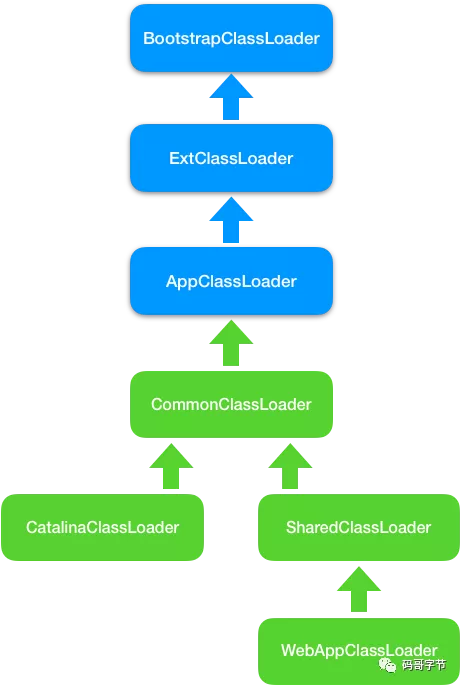

##### 1. WebAppClassLoader

Tomcat 的解决方案是自定义一个类加载器 `WebAppClassLoader`， 并且给每个 Web 应用创建一个类加载器实例。我们知道，Context 容器组件对应一个 Web 应用，因此，每个 `Context`容器负责创建和维护一个 `WebAppClassLoader`加载器实例。这背后的原理是，**不同的加载器实例加载的类被认为是不同的类**，即使它们的类名相同。这就相当于在 Java 虚拟机内部创建了一个个相互隔离的 Java 类空间，每一个 Web 应用都有自己的类空间，Web 应用之间通过各自的类加载器互相隔离。

##### 2.SharedClassLoader

本质需求是两个 Web 应用之间怎么共享库类,并且不能重复加载相同的类。在双亲委托机制里，各个子加载器都可以通过父加载器去加载类，那么把需要共享的类放到父加载器的加载路径下不就行了吗。

因此 Tomcat 的设计者又加了一个类加载器 `SharedClassLoader`，作为 `WebAppClassLoader`的父加载器，专门来加载 Web 应用之间共享的类。如果 `WebAppClassLoader`自己没有加载到某个类，就会委托父加载器 `SharedClassLoader`去加载这个类，`SharedClassLoader`会在指定目录下加载共享类，之后返回给 `WebAppClassLoader`，这样共享的问题就解决了。

##### 3. CatalinaClassloader

如何隔离 Tomcat 本身的类和 Web 应用的类？

要共享可以通过父子关系，要隔离那就需要兄弟关系了。兄弟关系就是指两个类加载器是平行的，它们可能拥有同一个父加载器，基于此 Tomcat 又设计一个类加载器`CatalinaClassloader`，专门来加载 Tomcat 自身的类。

这样设计有个问题，那 Tomcat 和各 Web 应用之间需要共享一些类时该怎么办呢？

老办法，还是再增加一个 `CommonClassLoader`，作为 `CatalinaClassloader`和 `SharedClassLoader`的父加载器。`CommonClassLoader`能加载的类都可以被 `CatalinaClassLoader`和 `SharedClassLoader`使用

## 整体架构设计解析收获总结

通过前面对 Tomcat 整体架构的学习，知道了 Tomcat 有哪些核心组件，组件之间的关系。以及 Tomcat 是怎么处理一个 HTTP 请求的。下面我们通过一张简化的类图来回顾一下，从图上你可以看到各种组件的层次关系，图中的虚线表示一个请求在 Tomcat 中流转的过程。

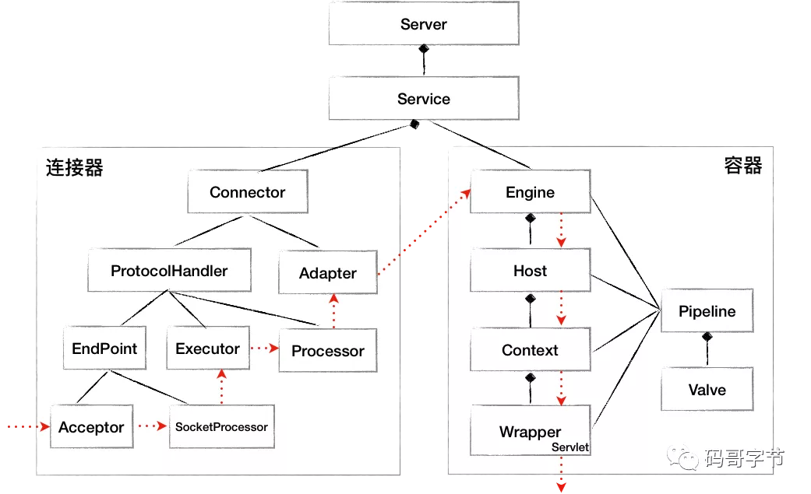


### 连接器

Tomcat 的整体架构包含了两个核心组件连接器和容器。连接器负责对外交流，容器负责内部处理。连接器用 `ProtocolHandler`接口来封装通信协议和 `I/O`模型的差异，`ProtocolHandler`内部又分为 `EndPoint`和 `Processor`模块，`EndPoint`负责底层`Socket`通信，`Proccesor`负责应用层协议解析。连接器通过适配器 `Adapter`调用容器。

对 Tomcat 整体架构的学习，我们可以得到一些设计复杂系统的基本思路。**首先要分析需求，根据高内聚低耦合的原则确定子模块，然后找出子模块中的变化点和不变点，用接口和抽象基类去封装不变点，在抽象基类中定义模板方法，让子类自行实现抽象方法，也就是具体子类去实现变化点。**

### 容器

运用了**组合模式 管理容器、通过 观察者模式 发布启动事件达到解耦、开闭原则。骨架抽象类和模板方法抽象变与不变，变化的交给子类实现，从而实现代码复用，以及灵活的拓展**。使用责任链的方式处理请求，比如记录日志等。

### 类加载器

Tomcat 的自定义类加载器 `WebAppClassLoader`为了隔离 Web 应用打破了双亲委托机制，它**首先自己尝试去加载某个类，如果找不到再代理给父类加载器**，其目的是优先加载 Web 应用自己定义的类。**防止 Web 应用自己的类覆盖 JRE 的核心类**，使用 **ExtClassLoader** 去加载，这样即打破了双亲委派，又能安全加载。

## 与SpringMVC的联系

由前文可知，tomcat最终将请求映射到了一个具体的Servlet上面，所以SpringMVC的DispatcherServlet也是这样进行映射的。

~~~java
// Spring-mvc项目中的SpittrWebAppInitializer类
// 将DispatcherServlet映射到“/”
@Override
protected String[] getServletMappings() {
    return new String[]{"/"};
}
~~~

因为将DispatcherServlet映射到“/”，所以所有的web请求都会由DispatcherServlet进行处理，DispatcherServlet会去寻找相应的Controller进行处理。

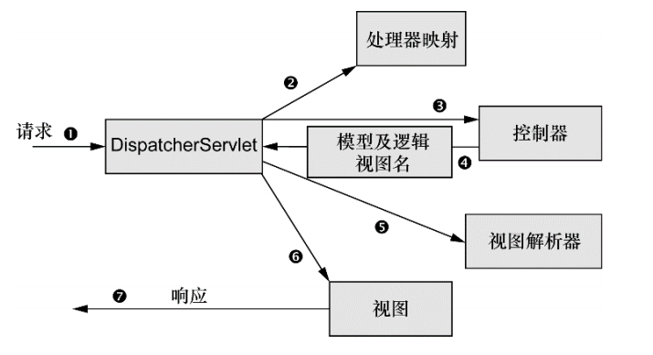

**注：**

**/  ：**表示（拦截/请求）路径

**/*  ：**表示（拦截/请求）所有文件夹和静态资源。**不包括子文件夹**。

**/\** ：**表式所有的文件夹和静态资源。**包括子文件夹**。


## 网络

###### 浏览器输入url之后，发生了生么

1. **首先是进行DNS解析，将url解析成为目标主机的IP地址。解析会进行如下几个步骤：**
   1. 查找浏览器缓存。不同的浏览器存储DNS记录的时间是不同的，一般是30s-2m左右。
   2. 查询系统缓存。若浏览器缓存中没找到，浏览器则会做系统调用（windows里是gethostbyname）进行查询。它会查询本地Host文件，Host的位置因系统而异。
   3. 若Host文件也没有，则向DNS服务器发出查询请求，DNS服务器一般为路由器或 ISP 的缓存 DNS 服务器。
   4. ISP的缓存DNS服务器进行递归查询，从根域名服务器查到顶级域名服务器再查到权限域名服务器。最后得到目标域名的IP地址。
2. **url解析成为IP地址之后，http会使用TCP，与目标主机建立TCP连接。以Tomcat为例：**
   1. TCP协议在8080端口对目标主机发起三次握手连接请求。首先将源主机的端口号、目标主机端口号封装到TCP报文中。
   2. TCP将报文交给下层的IP层，IP协议给报文段添加上源主机的IP和目标IP，并通过ARP地址解析协议由IP地址解析出mac地址。要是在源主机的ARP高速缓存中没有目标主机的IP和MAC，那么就在源主机所在的局域网中通过MAC广播，如果目标主机在这个局域网中，它会响应一个APR分组给源主机，源主机先将这个ARP携带的IP和MAC写入缓存中，并通过这个MAC地址发送MAC帧给目标主机。要是目标主机不在这个局域网中，那么会将MAC帧发送给网关路由，由它继续按照上面的步骤继续找目标主机。
3. **数据到了目标主机后，通过层层解析到TCP层。Tomcat会通过[连接器](# 连接器)接收请求的数据。具体来说：**
   1. 连接器中的EndPoint负责接收Socket流，然后交给Processor
   2. Processor负责将Socket流封装成Tomcat Request，然后将其交给Adapter
   3. Adapter将Tomcat Request封装成为标准的Servlet Request将其交给Servlet容器
4. **到达容器后，Tomcat通过Request中的URL在容器中找到对应的Servlet进行处理，详细过程[请求定位 Servlet 的过程](# 请求定位 Servlet 的过程)**

经过上面四步之后，源主机与目标主机就进行了初步的通信。当通过TCP三次握手之后，这样两个主机就可以进行正式的通信。


